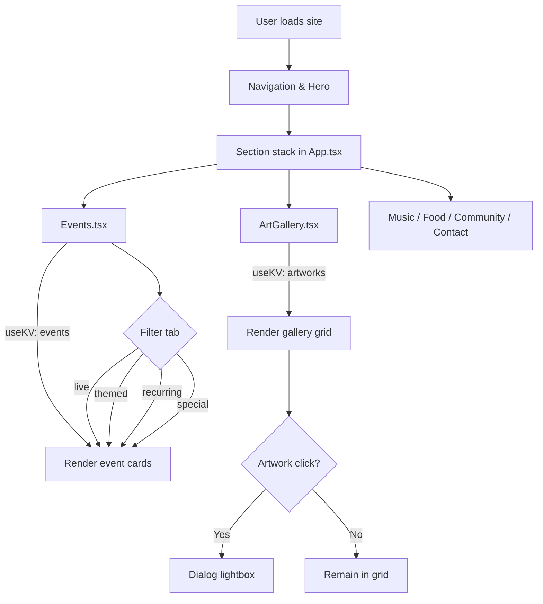
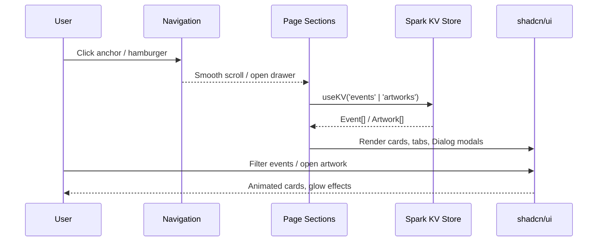
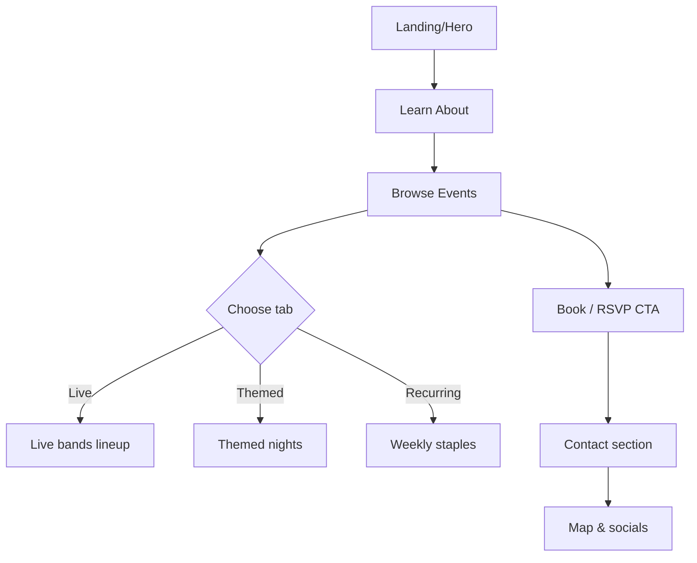
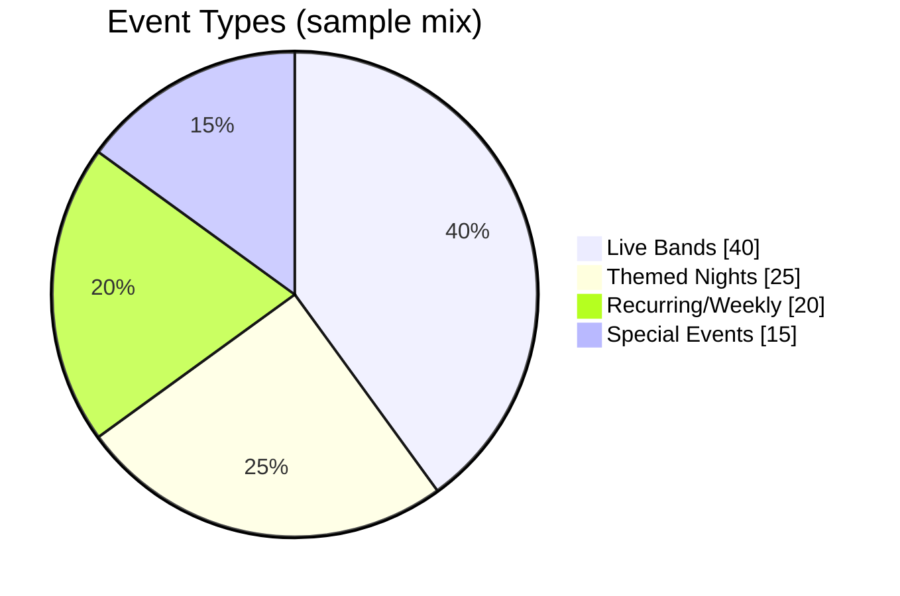
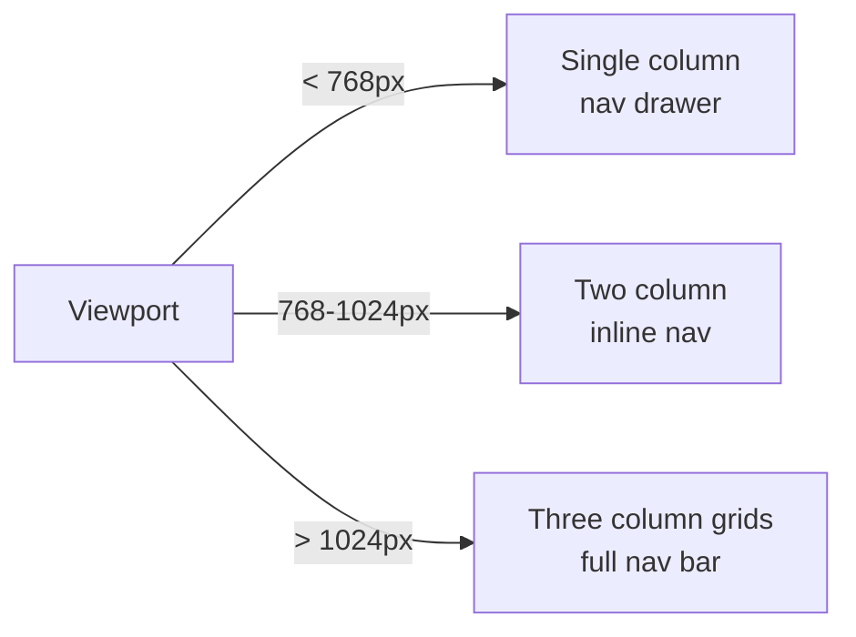
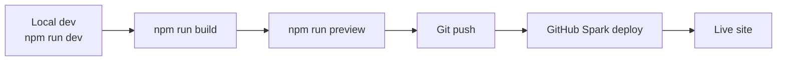

<div align="center">

# 🦑 The Kraken Lounge
**Brownsville's underground music sanctuary — metal, goth, punk, industrial, and electronic with a gothic red glow.**

</div>

## Quick links
- 🚀 [Run locally](#local-development)
- 🧭 [Architecture & data](#architecture--data-flow)
- 🎨 [Design system](#design-system)
- 🎛️ [Feature tour](#feature-tour)
- 📊 [Diagrams, charts, and flows](#diagrams-charts--flows)
- 🪄 [Animations](#animations)
- 🧪 [Quality & accessibility](#quality--accessibility)
- 🛠️ [Troubleshooting](#troubleshooting)

---

## Overview
The Kraken Lounge is a React + TypeScript single-page experience built with Vite, Tailwind v4, and shadcn/ui. It showcases events, rotating art galleries, community stories, and venue details for the alternative music community in Brownsville, TX. Data for events and artworks lives in the GitHub Spark KV store and is rendered client-side with responsive, motion-rich UI.

**Repository root:** `<project-root>` (the cloned repository directory)  
**Primary entry:** `src/App.tsx` (sections: Hero, About, Events, Music, Art Gallery, Food & Drinks, Community, Contact)  
**Data access:** GitHub Spark `useKV` hook for `events` and `artworks` keys  
**Address:** 1123 E Adams St, Suite C, Brownsville, TX 78520 — (956) 372-1550 — Open daily 5 PM–2 AM

---

## Tech stack at a glance

| Layer | Technologies |
| --- | --- |
| UI | React 19, TypeScript 5.7, shadcn/ui (Radix), @heroicons/react, @phosphor-icons/react |
| Styling | Tailwind CSS v4, custom CSS (glow/mesh/noise), OKLch color system, Google Fonts (Creepster, Bebas Neue, Space Grotesk) |
| Build | Vite 7 (SWC), `tsc -b --noCheck`, `vite preview`, `vite optimize` |
| Data | GitHub Spark KV store (`useKV<T>`), UUID, date-fns |
| Animation | CSS keyframes (`pulse-glow`, `card-glow`), Framer Motion (optional), Tailwind animation utilities |
| Tooling | ESLint 9 + TS ESLint, React Hooks ESLint |

---

## Local development
```bash
# 1) Install dependencies
cd <project-root>
npm install

# 2) Run dev server (http://localhost:5173)
npm run dev

# 3) Build for production & preview
npm run build
npm run preview
```

**Scripts (package.json)**
- `dev` — Vite dev server with HMR.
- `build` — `tsc -b --noCheck && vite build` (see Troubleshooting for the `--noCheck` flag note).
- `preview` — Serve the production bundle locally.
- `optimize` — Pre-bundle deps for faster cold starts.
- `lint` — ESLint (see Troubleshooting for enabling configuration).
- `kill` — Free port 5000 (used by some environments).

**Environment**
- No `.env` required for local use.
- Spark app ID is stored in `runtime.config.json` (`app: "9eaf2b34a52c0139af91"`).
- Assets: Cloudinary video for the hero background is loaded directly from the CDN.

---

## Feature tour
- **Sticky navigation & smooth scrolling** (`src/components/Navigation.tsx`): Desktop nav + mobile drawer with scroll-aware styling.
- **Hero** (`sections/Hero.tsx`): Cloudinary video background, flame icon glow, CTA to events.
- **About** (`sections/About.tsx`): Venue story, pandemic resilience, values (Rebellious · Authentic · Welcoming).
- **Events** (`sections/Events.tsx`): Tab filters (All/Live/Themed/Weekly/Special), genre badges, pricing, lineup, fallback empty states.
- **Music** (`sections/Music.tsx`): Genre pillars and recurring nights (Techno Sundays, Karaoke Wednesdays).
- **Art Gallery** (`sections/ArtGallery.tsx`): Lightbox Dialog for full artwork view; pulls from Spark KV `artworks`.
- **Food & Drinks** (`sections/FoodDrinks.tsx`): Kraken pizza highlight + beverage program.
- **Community** (`sections/Community.tsx`): University partnerships, festivals, charitable initiatives.
- **Contact** (`sections/Contact.tsx`): Address, hours, phone, map link, socials, booking CTA.
- **Error boundary** (`src/ErrorFallback.tsx`): Friendly crash screen with retry.
- **UI kit** (`src/components/ui/*`): shadcn-derived components (Card, Button, Dialog, Tabs, Badge, Sheet, etc.) themed for gothic red styling.

---

## Architecture & data flow




**Data models**
- `Event`: `{ id, title, date, time, type: 'live' | 'themed' | 'recurring' | 'special', genres: string[], bands?: string[], description, price?: string }`
- `Artwork`: `{ id, title, artist, imageUrl, description }`

**Persistence**
- GitHub Spark KV (no separate database). Populate `events` and `artworks` via the Spark dashboard. Components render graceful empty states when keys are missing.

---

## Diagrams, charts & flows
**User journey (navigation-first)**


**Event mix snapshot**


**Weekly rhythm**

```mermaid
gantt
    dateFormat  HH:mm
    axisFormat  %H:%M
    title Nightly cadence (example)
    section Floor opens
    Doors open       :done, 17:00, 1h
    section Programming
    Happy hour       :active, 18:00, 2h
    Live / DJ sets   :crit, 20:00, 4h
    Late-night mix   : 00:00, 2h
```


**Mobile vs desktop layout**


**Deployment lifecycle**


---

## Animations
- **Live preview**: The hero uses a Cloudinary-hosted looping video with a pulse-glow flame icon and gradient overlay. (Description: dark stage ambience with red lighting and subtle motion.)

  ```html
  <video
    src="https://res.cloudinary.com/dw3lf8roj/video/upload/v1738279880/kraken-hero_qdsyfk.mp4"
    autoplay
    loop
    muted
    playsinline
    title="Hero background preview video showing red-lit stage ambience"
    style="max-width:100%; border-radius:12px; box-shadow:0 0 30px rgba(255,0,0,0.25);"
  />
  ```

- **Keyframe set pieces** (defined in CSS):
  - `pulse-glow`: Soft breathing glow used on hero iconography.
  - `card-glow`: Hover lift + red border and shadow for interactive cards.
  - Respectful of `prefers-reduced-motion` — motion tones down when users prefer less animation.

- **Interactive micro-motions**:
  - Nav bar shadow appears after scrolling >50px.
  - Mobile drawer slides from the right; closes on selection.
  - Tabs animate active state in Events.
  - Dialog lightbox fades/zooms artworks in.

- **Add more motion safely**: Prefer Framer Motion for controlled spring transitions; keep durations under 200–250ms and expose `reducedMotion` variants.

---

## Content management
- **Events**: Manage via Spark KV key `events` (`Event[]`). Tabs auto-filter on `type`.
- **Artworks**: Manage via Spark KV key `artworks` (`Artwork[]`). Lightbox uses the Dialog component.
- **Venue info**: Static content in sections (address, hours, phone, socials).
- **Empty states**: Components show friendly fallbacks when KV data is empty—safe to deploy without seeded data.

---

## Quality & accessibility
- OKLch palette tuned for ≥7:1 contrast on text vs. background.
- Semantic landmarks (`nav`, `main`, `section`, `footer`); focus-visible and aria labels on actionable icons.
- Motion respects `prefers-reduced-motion`.
- External assets served from Cloudinary CDN for performance; Vite/SWC for optimized bundles.

- **Testing**
  - No automated tests are currently configured. For manual verification: launch `npm run dev`, exercise tabs, Dialogs, and navigation (desktop + mobile widths).
  - Linting guidance: see Troubleshooting for the ESLint configuration requirement.

---

## Troubleshooting
| Issue | Fix |
| --- | --- |
| `npm run lint` complains about missing `eslint.config.*` | Add an ESLint flat config (ESLint ≥9) or use an `.eslintrc` with the migration guide. |
| `npm run build` uses \`tsc -b --noCheck\` | `--noCheck` is not a valid TypeScript flag; remove it for normal checking or replace it with `--noEmit` if you want to type-check only without emitting JS. |
| Port already in use | Run `npm run kill` or stop the conflicting process on port 5000/5173. |
| Cloudinary video blocked | Replace the hero `videoUrl` in `Hero.tsx` with a reachable CDN asset. |
| Empty events/gallery | Seed data via Spark dashboard (`events` / `artworks` keys) or supply local defaults in components for preview. |

---

## Project map
```
/src
  /components
    Navigation.tsx          # Sticky nav + mobile drawer
    ErrorFallback.tsx       # Global error boundary UI
    /sections               # Page sections (Hero, About, Events, Music, ArtGallery, FoodDrinks, Community, Contact)
    /ui                     # shadcn/ui primitives themed for the lounge
  /assets                   # (If added) static assets
index.css, main.css         # Theme tokens, layout, animation layers
vite.config.ts              # Vite + Tailwind + React SWC plugins
tailwind.config.js          # Tailwind v4 config
runtime.config.json         # Spark app id
spark.meta.json             # Spark metadata
```

---

## Contributing
1. Branch from `main` (or the active development branch).
2. Keep changes scoped and atomic; prefer updating existing sections over adding new files when possible.
3. Run `npm run build` (and lint once ESLint config is added) before opening a PR.
4. Document UI or content changes in this README if they affect behavior, data, or visual systems.

---

## Community heartbeat
- **UTRGV Subculture Initiative** — Workshops, VR tours, and academic partnership.
- **Hernandez-Brownsville Music Festival** — 11-band showcase featuring regional heavy acts.
- **Charity drives** — Past events like Woofstock 2018 and fundraising nights.
- **Local art rotation** — Monthly spotlight on Brownsville artists; Dialog lightbox for full views.
- **Open, inclusive space** — LGBTQ+ and alt subcultures welcomed; affordable cover/pricing where applicable.

---

### If you only have 30 seconds
- Run: `npm install && npm run dev`
- Data: Manage `events` and `artworks` via Spark KV
- Sections: Hero → About → Events → Music → Art Gallery → Food & Drinks → Community → Contact
- Visuals: Dark OKLch palette, red glow highlights, video hero, animated cards/Dialogs
- Deploy: GitHub Spark (build: `tsc -b --noCheck && vite build`; see Troubleshooting for the flag note)
